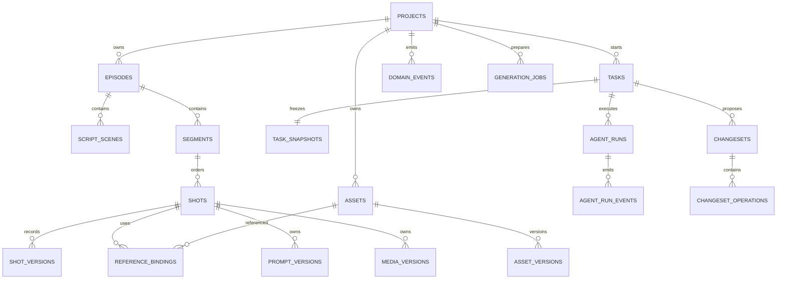

# Workbench 领域 ER

初始数据库表：`schema_migrations`、`projects`、`episodes`、`script_scenes`、`segments`、`shots`、`shot_versions`、`assets`、`asset_versions`、`reference_bindings`、`prompt_versions`、`media_versions`、`surface_contexts`、`tasks`、`task_snapshots`、`agent_runs`、`agent_run_events`、`changesets`、`changeset_operations`、`changeset_impacts`、`changeset_warnings`、`domain_events`、`generation_jobs`。

真实依赖只由 `reference_bindings`、Prompt/Media owner 和明确查询表达；v1 不建通用 `dependency_edges`。
