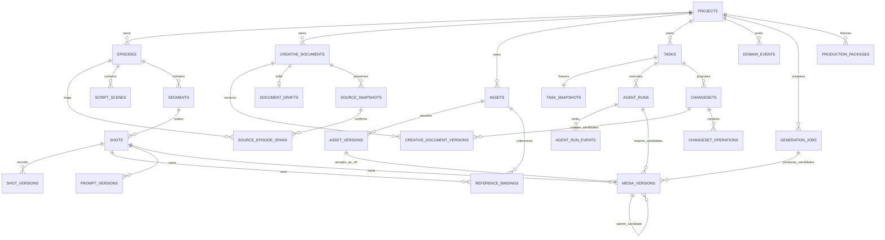

# Workbench 领域 ER

数据库在初始工作台表之外，通过 additive migration 增加
`creative_documents`、`creative_document_versions`、`document_drafts`、
`source_snapshots` 与 `projects.archived_at`。创作 Markdown 版本是一级事实；
`ScriptScene` 与 `Segment` 只能从 accepted screenplay 单向投影。

阶段 2 中，TaskSnapshot 冻结来源 document version、目标 document revision、选择和
Skill tree hash；claim 与 AgentRun 创建是一个事务。ChangeSet apply 产生的文档版本带
`source_changeset_id` 与 `created_by=agent`，状态仍为 `SUBMITTED`，不会成为 current version。

阶段 3 中，accepted development 内的机器可读分集地图与正文是同一个不可变版本；每集
必含参与 fingerprint 的非空 `story`。地图删除的 Episode 显式标记 `removed`，重新纳入前
不得接受旧候选、重试投影或启动剧本 Task。
多集整稿还以 UTF-8 byte span 与 SHA-256 把每集映射回 source snapshot；确认事务成功前不创建
Episode 或单集 screenplay。accepted screenplay 严格解析后创建新的 projection revision，旧
ScriptScene/Segment 只转为 `retired`；下游用 `source_document_version_id`、
`source_projection_revision` 与 `derived_from_ids_json` 记录谱系。每个文档版本也固定其
`source_document_version_id`；development 只从候选精确来源解析 source snapshot。系统只
精确标记当前 screenplay 文档的实际旧投影为 stale，NULL lineage 的人工/legacy 事实不受影响。
`tasks.batch_key` 只用于聚合独立 Task，不改变每个 Task/AgentRun 的生命周期。

阶段 4 中，GenerationJob 每个输出都先成为非 current 的 Media candidate；局部编辑通过
`parent_candidate_id` 保留父候选。创作者接受图片后才在同一事务内创建 AssetVersion/正式 REF，
并沿现有 `reference_bindings` 精确标记跟随旧 REF 的 Shot、Prompt、Media 与 Binding stale。
Agent 二进制导入绑定冻结 Task/AgentRun/owner/prompt/SHA-256，经 daemon staging 摄取；
不接受任意路径，也不把二进制放进 ChangeSet JSON。

阶段 5 中，本地 H3 FL2VA 继续复用 GenerationJob 与 Media candidate。GenerationJob 持久化
外部 job ID、提交 fingerprint 和远端状态；H3 成片只能从 loopback content endpoint 流入
Media Store，不能提供本地输出路径。ProductionPackage 是项目下不可变的版本化 manifest，
shot-owned 视频接受后只在该 Shot 的 video 槽内成为 current，不创建或替换 AssetVersion。
ProductionPackage 只引用 accepted facts，并显式记录 missing、failed、stale 与 excluded。

真实依赖只由 `reference_bindings`、Prompt/Media owner 和明确查询表达；v1 不建通用 `dependency_edges`。
